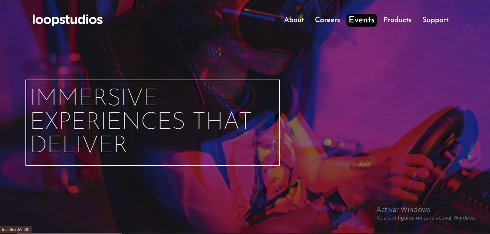

# LOOPSTUDIOS 
**Este es un desafio creado gracias a los desafios de Frontend Mentor. El cual consiste es probar mis habilidades con CSS grid, HTML y un poco de JavaScript.**

**Este desafío se centra principalmente en HTML y CSS. Se incluye un poquito de JS para alternar la navegación móvil.**

**Link del sitio activo:**
[LoopStudios](http://https://leonardo291024.github.io/landing-page-loopsStudios/ "LoopStudios")

;
